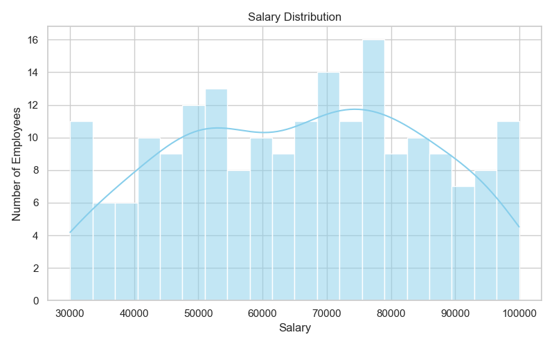
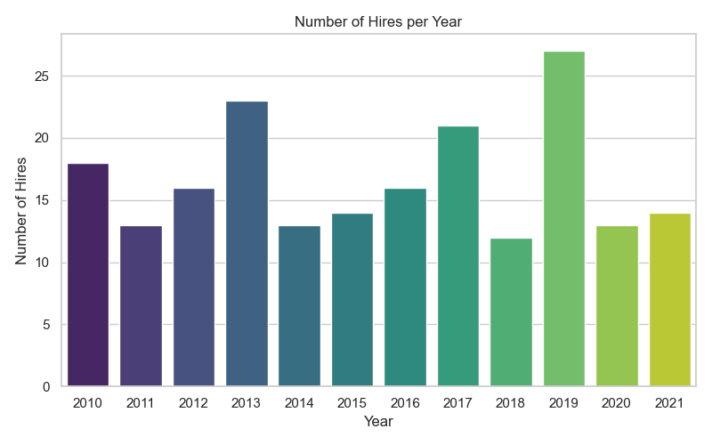

# Employee Records ETL and Visualization Project

## Project Overview
This project demonstrates a simple data engineering workflow: extracting, transforming, and loading (ETL) employee records from a CSV file into a SQLite database, and visualizing key insights from the data using Python.

## Features
- **ETL Pipeline:**
  - Reads employee data from a CSV file
  - Cleans and transforms the data (type conversion, enrichment, validation)
  - Loads the processed data into a SQLite database
- **Data Visualization:**
  - Plots salary distribution
  - Plots number of hires per year
  - Saves charts as PNG files for easy access

## Project Structure
```
DE/
│   employee_records.csv         # Source data (CSV)
│   employees.db                 # SQLite database (output)
│   README.md                    # Project documentation
│   .gitignore                   # Git ignore rules
│
├───visualizations/              # Folder for saved chart images
│       salary_distribution.png
│       hires_per_year.png
│
└───DE/
    │   etl_employee_records.py   # ETL pipeline script
    │   visualize_employees.py    # Data visualization (interactive)
    │   all_visualizations.py     # Script to save all charts as PNGs
```

## Setup Instructions
1. **Clone or download this repository.**
2. **Install Python 3.8+** (if not already installed).
3. **Install required Python packages:**
   ```sh
   pip install pandas sqlalchemy matplotlib seaborn
   ```

## How to Run the ETL Pipeline
1. Place your `employee_records.csv` in the project root (`DE/`).
2. Run the ETL script to process the CSV and load data into the database:
   ```sh
   python DE/etl_employee_records.py
   ```
   - This will create/update `employees.db` with a table `employees` containing the cleaned and enriched data.

## How to Visualize the Data (Interactive)
1. Run the visualization script to generate charts interactively:
   ```sh
   python DE/visualize_employees.py
   ```
   - This will display:
     - A histogram of salary distribution
     - A bar chart of number of hires per year

## How to Save All Visualizations as Images
1. Run the batch visualization script to save charts as PNG files:
   ```sh
   python DE/all_visualizations.py
   ```
   - You can run this script from either the project root or the `DE/` subfolder; it will automatically find the correct database and save images in the `visualizations/` folder.
   - The following files will be created/updated:
     - `visualizations/salary_distribution.png`
     - `visualizations/hires_per_year.png`

## How to Access the Saved Charts
- Open the `visualizations/` folder in your project root to view the generated PNG files.
- These images can be shared, embedded in reports, or used for presentations.

## Example Outputs
- **Salary Distribution:** Histogram showing the spread of employee salaries.
- **Number of Hires per Year:** Bar chart showing hiring trends over time.
- **Saved Images:** PNG files in the `visualizations/` folder for easy access.

## Example Visualizations

### Salary Distribution



### Number of Hires per Year



## Extension Ideas I'd like to add in future
- Automate the ETL process (e.g., with a scheduler or Airflow)
- Add more data validation and error logging
- Build an API to serve employee data
- Integrate with cloud storage (AWS S3 or GCP)
- Add more visualizations (e.g., by department, gender)

## License
This project is for educational purposes.
